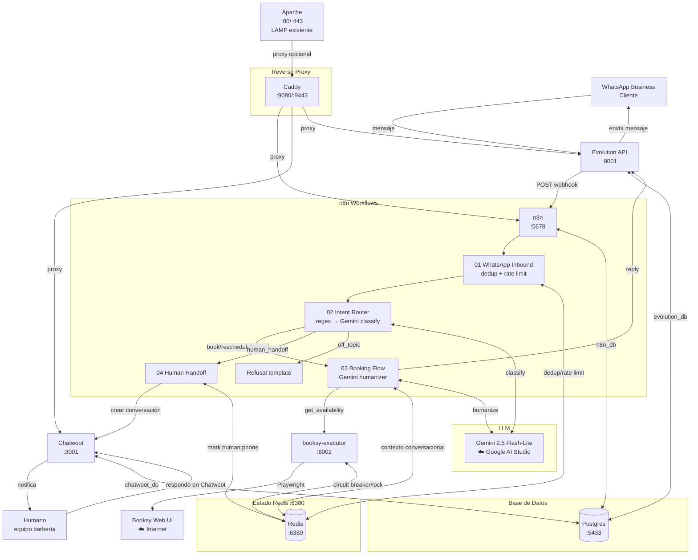

# Arquitectura — Lighthouse Bot

## Flujo end-to-end

## Decisiones de arquitectura clave

| Decisión | Elegida | Razón |
|---|---|---|
| Booksy integration | Playwright stealth | No hay Partner API en plan básico |
| LLM | Gemini 2.5 Flash-Lite | Costo más bajo de Gemini 2.5 |
| Estado | Redis | Sub-ms, TTL nativo, rate limit nativo |
| DB | Postgres 16 | n8n y Chatwoot la requieren; no usar MariaDB del LAMP |
| Orquestador | n8n | Open source, self-hosted, visual, webhooks nativos |
| Gateway WhatsApp | Evolution API v2 | Open source, persistente, QR/pairing |
| Reverse proxy | Caddy | TLS automático, config simple, loopback para exposición |

## Separación de responsabilidades

- **n8n:** orquestación, estado conversacional, llamadas a LLM
- **booksy-executor:** Playwright, circuit breaker, snapshots de fallos
- **Chatwoot:** bandeja de mensajes para el equipo humano
- **Redis:** estado efímero (dedup, rate limit, contexto, locks)
- **Postgres:** estado persistente (workflows n8n, conversaciones Chatwoot)
- **Caddy:** TLS y reverse proxy del stack (no toca el LAMP de Apache)
